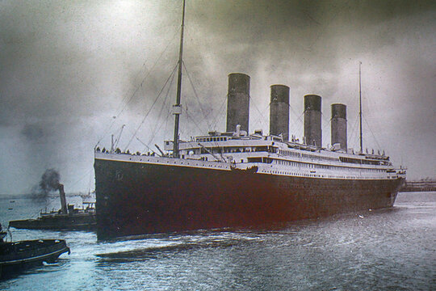
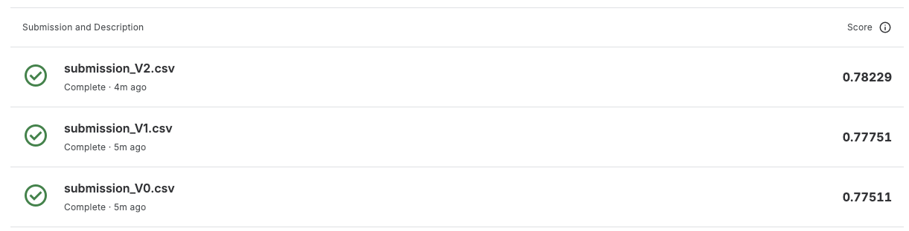

# Titanic - Machine Learning from Disaster



My solution to Kaggle's [Titanic competition](https://www.kaggle.com/competitions/titanic/overview): predict which passengers survived the 1912 shipwreck from data such as age, sex, and passenger class. It's the classic entry-level machine learning problem, so I used it to practise an iterative workflow — from a simple baseline to a tuned sklearn pipeline.

## Results

| Version | Features | Model | Public score |
|---------|----------|-------|--------------|
| V0 | Sex, Pclass | RandomForest (defaults) | 0.77511 |
| V1 | + Age (imputed by title), FamilySize | RandomForest (hand-tuned) | 0.77751 |
| V2 | + Title | Pipeline + GridSearchCV | 0.78229 |



## Approach

- **EDA** (`EDA.py`) — survival rates by sex, class, age, and family size.
- **V0** — a 2-feature baseline to validate the end-to-end flow.
- **V1** — impute missing ages from the title extracted from the name (Mr, Miss, Mrs...), add a FamilySize feature.
- **V2** — move age imputation into an sklearn `Pipeline` and tune hyperparameters with `GridSearchCV`.

## Structure

```
.
├── EDA.py           # exploratory data analysis
├── version/         # V0, V1, V2
├── dataset/         # train.csv, test.csv
└── submission/      # generated predictions
```

## Run

```bash
uv sync
cd version && python3 V2.py    # writes submission/submission_V2.csv
```
